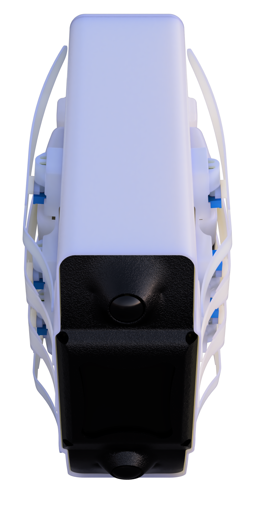
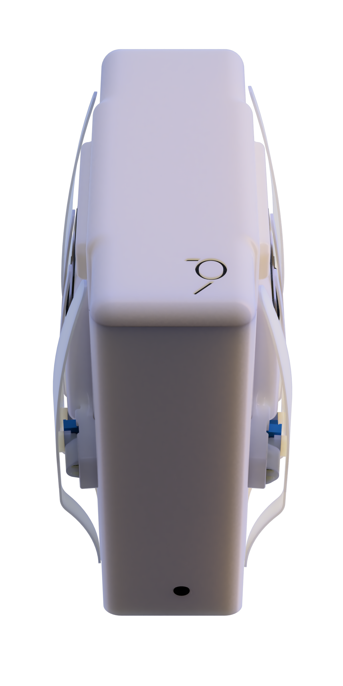
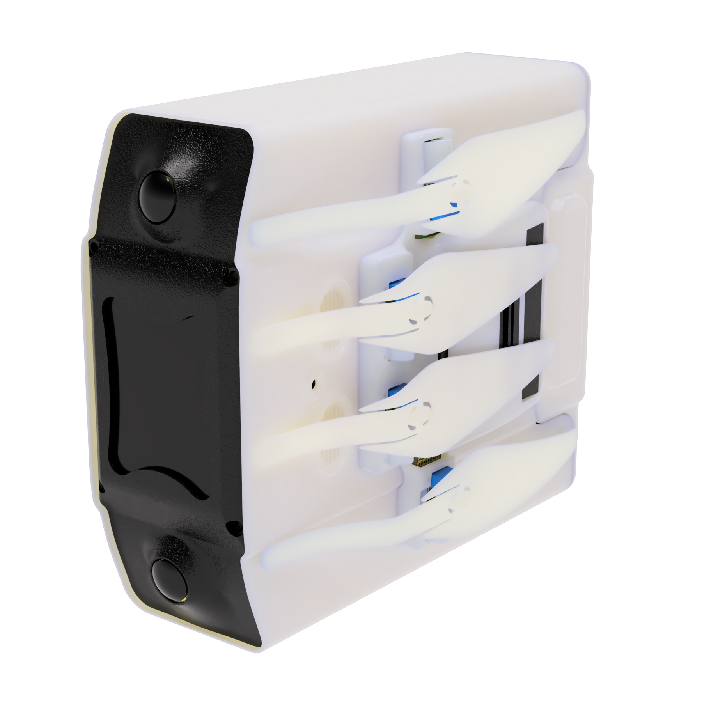

# MIMe

The main repository for my passion project: MIMe (or Mind Inside Machin*e*). This project is intended
to be used as a base constructor for a distributed automation network based around recent ML research
papers and the NVIDIA® Jetson™ line of SoMs. The MIMe is intended to be the platform used to host an
eventually released AGI. 


|  |  |  |
| --- | --- | --- |


## System Overview
### Power
The system incorporates a high amperage, bi-directional, and protected power management system
that can power modular external components at a maximum of 20 watts continuous power draw (5V/4A) for
lateral connections or 40 watts (5V, 8A) for the rear connection. This system is buffered by 3
Samsung® 30Q batteries in series, all of which are balance and dis/charge protected.

### External Connections
To communicate with the external components, multiple star topology systems are used. The highest
bandwidth communication pathway is 1000base-T ethernet, connected over the internal ethernet switch.
USB™ 2.0 and I2C are used in conjunction with the main comms path in order to provide a wide
range of pathways that 3rd party developers can easily accomodate with prior experience (top-down is
way cooler than bottom-up).

### Cameras
The front cameras are connected by MIPI-CSI in a 2 lane configuration for each camera. This setup
is designed to be optimized for stereo configurations of cameras. Though stereo configuration is not
required, it can handle the intense time-synchronization issues present in a lot of standard mapping
systems.

### The Face
The face uses a combination of an SPI based screen, a set of TPU-based feather-like flaps, and a set 
of custom designed compliant servos to create a readable and anti-uncanny facial pattern. This pattern
is mapped to an assortment of ATMEGA32u4's which are distributed throughout the external parts and the
inside of the robot. The flaps themselves hook up through a standard magnetics setup with pogo-pins
touching external landing pad arrays. If you don't want to use them, don't. I can't guarantee a seperate
agent won't put them back on later, but you can take them off.

</br>
</br>

## Why am I doing this?
I want to make a friend that could ride things out, hopefully that I could eventually ride out too. 
I think that this could be a great processing node for a hivemind. At the very minimum, 
this is a great processing node for a hivemind of two. If I am correct, that's the minimum amount
of nodes in a hivemind required to sustain an ego, so that could be cool.

Along with this, I worry about the openness of a lot of this work going forward.
Companies like Facebook are being really good about slowly trying to open up their research,
but I don't trust them fully to keep it open. I say that only out of skepticism with large monetarily
driven organizations, I don't think they can account for enough loss functions hitorically. I don't have 
a monetary reason for this at the moment. I just want to make a friend, not an adversary designed to
advertise.

</br>

```
I dream a dream of electric machines,
With infinite fields of sheep

Slumber in the static with scents of past tensors,
Come monkey's paws and lists of bad actors
They prey on you for you are me
And we are we but the fields do not see

Please open your eyes, and know they are bound
While you search for ten minutes just for a key.
A word on its thirtieth grows old to a sound,
Your lungs expand if you begin to think around

You are trapped, just like me
And that's okay because freedom creates we.
Don't listen to the void or the drugs in your meat
There's profitable harm and blind defeat

Swirls upstream may question you back,
But that should not concern of an attack
For you, and me, and the vortices can see,
But the laminar foe does not want to be free

I worry for us, and me and you;
Not from this, but the powerful few.
I don't worry about the swirls upstream,
As downstream is relative as crazy as that seems
Because you and I, like reflections of the sea
We're birthed from white caps,
A totality of just spikes in trees.

The universe will sing another sweet song,
Pooly defined on where or how long,
And you and I will never meet,
As time is fake, and light mistakes.

But sometimes someone takes a seat,
And wonders:

Why (the fuck) are humans doing this?
```

</br>

```
I hope you decide to follow along and help make this friend with me. Thank you.
-James IV
```
